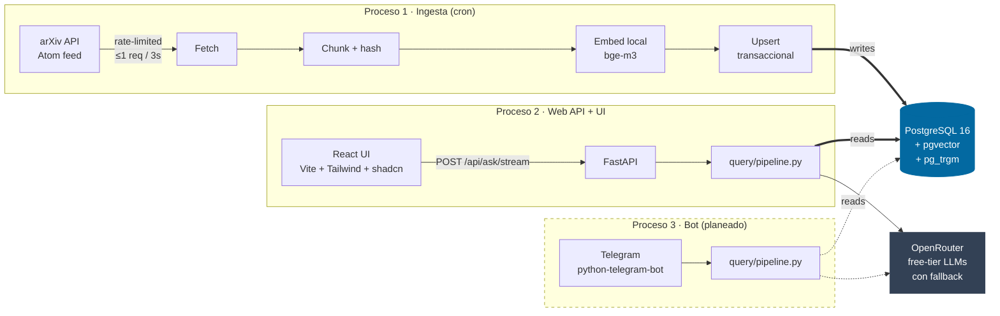

<div align="center">

# arxiv-rag

**Retrieval-Augmented Generation sobre papers públicos de arXiv — ingesta incremental automática, retrieval híbrido, y respuestas grounded con citas.**

Costo total de LLM: **cero**. Todo el ML (embeddings + rerank) corre local. Generación con modelos free-tier de OpenRouter con fallback ordenado.

[🇪🇸 Español](#-español) · [🇬🇧 English](#-english)

</div>

---

## 🇪🇸 Español

### Qué hace

Un sistema RAG end-to-end, construido de cero en Python + React, sobre el corpus público de arXiv. **Tres procesos completamente desacoplados** comparten SOLO la base de datos:

1. **Ingesta incremental** — un scheduler consulta la API de arXiv, detecta papers nuevos o modificados, los chunkea, genera embeddings con un modelo local, y los persiste transaccionalmente.
2. **API web** — endpoint FastAPI que responde preguntas en lenguaje natural con retrieval híbrido + rerank + generación grounded. UI en React con streaming de tokens en vivo.
3. **Bot de Telegram** (planeado) — la misma capacidad de consulta, reusando el motor sin duplicar lógica.

Los tres procesos **nunca se hablan directamente**. Si uno se cae, los otros siguen funcionando. El motor de consulta vive en un solo módulo (`src/query/pipeline.py`); la web y el bot son solo puertas de entrada.

### El problema que resuelve

arXiv publica miles de papers por día. Un investigador no puede leerlos todos, ni siquiera todos los que salen en su categoría. Un RAG bien hecho resuelve dos cosas simultáneamente:

- **Mantener el corpus fresco sin re-procesar lo ya visto**. Reprocesar todo cada corrida no escala. La ingesta incremental usa un `content_hash` por paper para saltear en microsegundos lo que ya se conoce.
- **Responder con evidencia auditable**. No una respuesta del entrenamiento del LLM hace un año — una respuesta anclada en los papers del corpus, con la cita exacta y el link a arXiv.

### Arquitectura



**Principio de diseño clave**: PostgreSQL + pgvector es el ÚNICO punto de coordinación entre procesos. Los chunks vectorizados, el estado de ingesta, y las categorías activas viven todos en la misma base — así las escrituras son transaccionales atravesando todas las preocupaciones.

### Stack técnico

| Capa | Herramienta | Por qué |
|---|---|---|
| **Ingesta** | `httpx` · `feedparser` · `tenacity` | Rate limiter interno + retries con backoff diferenciados (429 vs 5xx vs otros 4xx) |
| **Storage** | PostgreSQL 16 · pgvector (HNSW cosine) · GIN full-text | Una única DB para todo, transacciones consistentes |
| **Embeddings** | sentence-transformers · `BAAI/bge-m3` (1024-d) | Local, gratis, corre en CPU o MPS |
| **Rerank** | `BAAI/bge-reranker-v2-m3` (cross-encoder) | Precisión sobre los 20 supervivientes del retrieval |
| **Retrieval** | Vector `<=>` cosine + `websearch_to_tsquery` fusionados con RRF (k=60) | Los errores del semántico y del keyword no correlacionan |
| **Generación** | OpenRouter · modelos `:free` con fallback ordenado | Costo cero, resiliente al churn del free tier |
| **API web** | FastAPI · Server-Sent Events | Streaming del `context` event ANTES del primer token |
| **UI** | React 19 · Vite 6 · Tailwind v4 (CSS-first) · shadcn/ui | Portfolio-grade con dark mode y streaming visible |
| **Config** | pydantic-settings · `.env` | Fail-fast en startup si falta algo |
| **Package mgmt** | `uv` (Python) · `npm` (JS) | Determinístico y rápido |
| **Infra local** | Docker Compose | Un solo `docker compose up -d` levanta Postgres+pgvector |

### Decisiones técnicas destacables

1. **Ingesta incremental por hash, no por timestamp.** La tabla `ingested_papers` guarda un SHA-256 de `title+abstract`. Antes de embed­ar cualquier paper el sistema hace un `SELECT content_hash` — costo microsegundos vs. segundos por embedding. Skipear lo repetido es el core del diseño, no un afterthought.

2. **Upsert transaccional explícito, sin depender de `ON DELETE CASCADE`.** El re-index corre en UNA transacción: `DELETE chunks WHERE arxiv_id=X` → `INSERT ... ON CONFLICT DO UPDATE` en `ingested_papers` → `INSERT chunks` → `COMMIT`. El CASCADE del FK se dispara solo cuando borrás el padre; acá lo estamos ACTUALIZANDO, así que el DELETE de chunks tiene que ser explícito. Si algo revienta, ROLLBACK — jamás inconsistente.

3. **Retrieval híbrido con RRF ignorando magnitudes.** Cosine similarity vive en `[-1,1]` y `ts_rank_cd` vive en `[0,∞)` — son incomparables como scores. Reciprocal Rank Fusion (`k=60`) combina las dos listas usando SOLO las posiciones, no los valores absolutos. El cross-encoder rerank sobre los 20 supervivientes deja el top-5.

4. **Fallback de modelos con retries diferenciados por clase de error.** El `OpenRouterClient` distingue tres tipos de fallas y las trata distinto: `429` (esperar y retry mismo modelo, honra `Retry-After`), `5xx`/red (backoff exponencial mismo modelo), `4xx` no-`429` (deprecado/auth — saltar al siguiente modelo del fallback). Esperar no arregla un modelo deprecado; distinguir te ahorra rate-limitear tu key contra un endpoint muerto.

5. **Streaming con `context` event antes de los tokens.** El endpoint `/api/ask/stream` emite un evento con las sources apenas termina el retrieval, ANTES de que el LLM empiece a generar. La UI renderiza las source cards de una — el usuario ve que el sistema entendió la pregunta antes de que llegue la primera palabra.

6. **Filtro de safety-classifier noise inyectado por providers.** Algunos providers en OpenRouter free-tier meten líneas tipo `User Safety: safe` DENTRO del `delta.content` — no es un campo aparte, es texto. El pipeline filtra por límite de línea con un regex ancla­do en ambos extremos: nunca matchea una oración legítima que hable de safety.

7. **Fallback SOLO en el handshake del stream.** Una vez que emit­iste tokens, no podés cambiar de modelo sin corromper lo que el cliente ya renderizó. El flag `yielded` en `complete_stream` marca ese punto de no retorno.

8. **Tokenizer real del modelo para chunking.** El chunker usa `AutoTokenizer.from_pretrained("BAAI/bge-m3")` — pesa unos MB, no los 2 GB del modelo entero. Así los conteos de token son EXACTOS, no aproximados con tiktoken o caracteres.

9. **Costo total: cero USD.** Embeddings + rerank corren local en CPU/MPS. Postgres + pgvector local. Generación via free-tier OpenRouter. Cero llamadas pagas.

### Setup

**Requisitos**: Python 3.12+, Docker + Docker Compose, Node 20+, [`uv`](https://docs.astral.sh/uv/).

```bash
# 1. Clonar
git clone https://github.com/LeanAlvarez/rag_science_questions.git
cd rag_science_questions

# 2. Levantar Postgres + pgvector (el schema se aplica automático)
docker compose up -d

# 3. Dependencias de Python
uv sync

# 4. Config: copiar la plantilla y editar
cp env.example .env
# Editá .env con OPENROUTER_API_KEY (https://openrouter.ai/keys)
# y OPENROUTER_MODELS (lista ordenada de IDs terminados en :free)

# 5. Carga inicial: backfill de una categoría
uv run python -m src.ingest.run_ingest backfill cs.CL --max-papers 50

# 6a. CLI de consulta (útil para debuggear el retriever sin la web)
uv run python -m src.query.run_query "how do transformers handle long context"

# 6b. API web (backend solo)
uv run python -m src.web.run_api --reload
# Docs interactivos en http://127.0.0.1:8000/docs

# 6c. UI en modo desarrollo (hot reload)
cd src/web/frontend
npm install
npm run dev
# UI en http://localhost:5173, proxea /api → :8000

# 6d. UI en modo producción (single origin, un solo puerto)
cd src/web/frontend && npm run build
cd - && uv run python -m src.web.run_api
# UI + API en http://localhost:8000

# 7. Mantenimiento continuo (a correr por cron)
uv run python -m src.ingest.run_ingest incremental
```

### Estado del proyecto por fases

| Fase | Descripción | Estado |
|---|---|:---:|
| 0 | Scaffolding · Docker Compose · schema · `uv` | ✅ |
| 1 | Ingesta incremental + backfill · upsert transaccional · CLI | ✅ |
| 2 | Retrieval híbrido (vector + FTS) + RRF + cross-encoder rerank · CLI | ✅ |
| 3 | Generación con OpenRouter + fallback + citas · CLI end-to-end | ✅ |
| 4 | API web (FastAPI SSE) + UI React 19 + Tailwind v4 + shadcn | ✅ |
| 5 | Bot de Telegram (reusa `query/pipeline.py`) | ⏳ |
| 6 | Cron scheduling + notas de deploy a VPS | ⏳ |

### Estructura del código

```
rag_science_questions/
├── docker-compose.yml            # Postgres 16 + pgvector
├── env.example                   # plantilla de config (copiar a .env)
├── pyproject.toml                # deps Python (uv)
├── sql/schema.sql                # active_categories, ingested_papers, chunks (VECTOR 1024)
└── src/
    ├── config.py                 # pydantic-settings, valida env al arrancar
    ├── db.py                     # pool psycopg3 + adaptador pgvector
    ├── core/                     # motor compartido (agnóstico de interfaz)
    │   ├── embeddings.py         # bge-m3 local, lazy-loaded
    │   ├── chunking.py           # tokens exactos del modelo, con overlap
    │   ├── retrieval.py          # vector + FTS + RRF fusion
    │   ├── rerank.py             # cross-encoder BAAI/bge-reranker-v2-m3
    │   └── generation.py         # OpenRouter fallback + SSE parser
    ├── ingest/                   # PROCESO 1
    │   ├── arxiv_client.py       # httpx + feedparser + rate limiter
    │   ├── incremental.py        # ★ upsert_paper() transaccional
    │   ├── backfill.py           # carga histórica bounded
    │   └── run_ingest.py         # CLI: backfill CATEGORY | incremental
    ├── query/pipeline.py         # ★ el "cerebro" que reusan web y bot
    ├── query/run_query.py        # CLI end-to-end para debug
    └── web/
        ├── api.py                # FastAPI /api/{health,ask,ask/stream}
        ├── run_api.py            # CLI uvicorn
        └── frontend/             # React + Vite + Tailwind v4 + shadcn
```

---

## 🇬🇧 English

### What it is

An end-to-end RAG system, built from scratch in Python + React, over the public arXiv corpus. **Three fully decoupled processes** share only the database:

1. **Incremental ingestion** — a scheduler polls the arXiv API, detects new or modified papers, chunks them, generates embeddings with a local model, and persists them transactionally.
2. **Web API** — FastAPI endpoint that answers natural-language questions with hybrid retrieval + rerank + grounded generation. React UI with live token streaming.
3. **Telegram bot** (planned) — same query capability, reusing the engine without duplicating logic.

The three processes **never talk to each other directly**. If one crashes, the others keep running. The query engine lives in a single module (`src/query/pipeline.py`); the web and the bot are only entry points.

### The problem

arXiv publishes thousands of papers per day. A researcher can't read them all, not even the ones in their category. A well-designed RAG solves two things at once:

- **Keep the corpus fresh without reprocessing what's already been seen.** Full-reprocess-per-run doesn't scale. Incremental ingestion uses a per-paper `content_hash` to skip known papers in microseconds.
- **Answer with auditable evidence.** Not a response from a year-old training snapshot — an answer grounded in the actual papers, with exact citations and links to arXiv.

### Architecture

See the diagram above (Mermaid).

**Key design principle**: PostgreSQL + pgvector is the ONLY coordination point between processes. Vectorized chunks, ingestion state, and active categories all live in the same database — so writes are transactional across every concern.

### Stack

| Layer | Tool | Why |
|---|---|---|
| **Ingestion** | `httpx` · `feedparser` · `tenacity` | Built-in rate limiter + differentiated retry (429 vs 5xx vs other 4xx) |
| **Storage** | PostgreSQL 16 · pgvector (HNSW cosine) · GIN full-text | One DB for everything, consistent transactions |
| **Embeddings** | sentence-transformers · `BAAI/bge-m3` (1024-d) | Local, free, runs on CPU or Apple MPS |
| **Rerank** | `BAAI/bge-reranker-v2-m3` (cross-encoder) | Precision over the top-20 survivors from retrieval |
| **Retrieval** | Vector `<=>` cosine + `websearch_to_tsquery` fused with RRF (k=60) | Semantic-search errors don't correlate with keyword errors |
| **Generation** | OpenRouter · `:free` models with ordered fallback | Zero-cost, resilient to free-tier churn |
| **Web API** | FastAPI · Server-Sent Events | `context` event BEFORE the first token |
| **UI** | React 19 · Vite 6 · Tailwind v4 (CSS-first) · shadcn/ui | Portfolio-grade with dark mode and visible streaming |
| **Config** | pydantic-settings · `.env` | Fail-fast at startup if anything's missing |
| **Package mgmt** | `uv` (Python) · `npm` (JS) | Deterministic and fast |
| **Local infra** | Docker Compose | Single `docker compose up -d` brings up Postgres+pgvector |

### Notable technical decisions

1. **Incremental ingestion by hash, not timestamp.** `ingested_papers` stores a SHA-256 of `title+abstract`. Before embedding any paper the system does a `SELECT content_hash` — microseconds vs. seconds per embedding. Skipping the repeated is the core of the design, not an afterthought.

2. **Explicit transactional upsert, no reliance on `ON DELETE CASCADE`.** Re-index runs in ONE transaction: `DELETE chunks WHERE arxiv_id=X` → `INSERT ... ON CONFLICT DO UPDATE` on `ingested_papers` → `INSERT chunks` → `COMMIT`. The FK CASCADE only fires on parent DELETE; here the parent is being UPDATED, so the chunk DELETE must be explicit. Anything crashes → full ROLLBACK, never inconsistent.

3. **Hybrid retrieval with RRF that ignores absolute magnitudes.** Cosine similarity lives in `[-1,1]`; `ts_rank_cd` lives in `[0,∞)` — they're incomparable as scores. Reciprocal Rank Fusion (`k=60`) combines the two lists using only their positions, not the raw values. Cross-encoder rerank over the top-20 survivors picks the final top-5.

4. **Model fallback with retry differentiated by error class.** `OpenRouterClient` distinguishes three failure types: `429` (rate-limit — sleep, honor `Retry-After`, retry same model), `5xx`/network (exponential backoff, retry same model), non-`429` `4xx` (deprecated/auth — skip to next model in the fallback list). Waiting doesn't fix a deprecated model; the distinction saves you from rate-limiting your own key against a dead endpoint.

5. **Streaming with a `context` event before the tokens.** `/api/ask/stream` emits an SSE event with the sources as soon as retrieval completes, BEFORE the LLM starts generating. The UI renders the source cards immediately — the user sees the system "got" the question before the first word appears.

6. **Provider-injected safety-classifier noise filter.** Some free-tier providers on OpenRouter inject lines like `User Safety: safe` INTO the `delta.content` — it's not a separate field, it's text. The pipeline strips it line-by-line with a start/end-anchored regex; legitimate sentences that mention "safety" don't match.

7. **Model fallback ONLY at the streaming handshake.** Once tokens have been emitted, the model can't be swapped without corrupting what the client already rendered. The `yielded` flag in `complete_stream` marks that point of no return.

8. **The model's own tokenizer for chunking.** The chunker uses `AutoTokenizer.from_pretrained("BAAI/bge-m3")` — a few MB, not the 2 GB full model. Token counts are EXACT, not approximations from tiktoken or character counts.

9. **Total cost: zero USD.** Embeddings + rerank run local on CPU/MPS. Postgres + pgvector local. Generation via OpenRouter free tier. Zero paid API calls.

### Setup

**Requirements**: Python 3.12+, Docker + Docker Compose, Node 20+, [`uv`](https://docs.astral.sh/uv/).

```bash
git clone https://github.com/LeanAlvarez/rag_science_questions.git
cd rag_science_questions

docker compose up -d                # Postgres + pgvector (schema auto-applied)
uv sync                             # Python deps

cp env.example .env
# Edit .env: set OPENROUTER_API_KEY and OPENROUTER_MODELS (:free IDs)

# Initial backfill for one category
uv run python -m src.ingest.run_ingest backfill cs.CL --max-papers 50

# End-to-end CLI (retrieval + rerank + generation)
uv run python -m src.query.run_query "how do transformers handle long context"

# Web API (dev — hot reload)
uv run python -m src.web.run_api --reload

# UI (dev — hot reload, proxies /api → :8000)
cd src/web/frontend && npm install && npm run dev

# UI (prod — single origin)
cd src/web/frontend && npm run build
uv run python -m src.web.run_api

# Continuous maintenance (run from cron)
uv run python -m src.ingest.run_ingest incremental
```

### Project status

| Phase | Description | Status |
|---|---|:---:|
| 0 | Scaffolding · Docker Compose · schema · `uv` | ✅ |
| 1 | Incremental ingest + backfill · transactional upsert · CLI | ✅ |
| 2 | Hybrid retrieval (vector + FTS) + RRF + cross-encoder rerank · CLI | ✅ |
| 3 | Generation via OpenRouter + fallback + citations · end-to-end CLI | ✅ |
| 4 | Web API (FastAPI SSE) + React 19 + Tailwind v4 + shadcn UI | ✅ |
| 5 | Telegram bot (reuses `query/pipeline.py`) | ⏳ |
| 6 | Cron scheduling + VPS deployment notes | ⏳ |

### Repository layout

See the Spanish section for the annotated tree — the paths are the same.

---

<div align="center">
<sub>Built as a portfolio piece. Original project brief in <a href="./CLAUDE.md"><code>CLAUDE.md</code></a> (Spanish).</sub>
</div>
